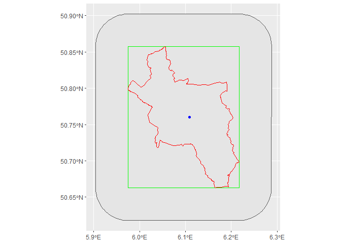

<!-- README.md is generated from README.Rmd. Please edit that file -->

# vg250

<!-- badges: start -->

[](https://github.com/dimfalk/vg250/actions/workflows/R-CMD-check.yaml)
[](https://codecov.io/gh/dimfalk/vg250)
<!-- badges: end -->

vg250 aims to provide access to VG250 dataset in order to derive spatial
information for a chosen administrative level for various applications.

Since I found myself in the need of spatial information on a
municipality level (geometry, extent, centroids) for convenience reasons
quite often, the decision was made to centralize associated data and
functions based on `{sf}` in a separate package to simplify maintenance.

## Installation

You can install the development version of vg250 with:

``` r
# install.packages("devtools")
devtools::install_github("dimfalk/vg250")
```

## Basic examples

Just a few quick insights on the use of this package:

``` r
library(vg250)
#> 0.5.5
```

``` r

# fetch data
name <- "Aachen"

ext <- get_extent(name)
buff <- get_extent(name, buffer = 5000)
geom <- get_geometry(name)
p <- get_centroid(name)

# check classes
class(ext)
#> [1] "sfc_POLYGON" "sfc"
```

``` r
class(buff)
#> [1] "sfc_POLYGON" "sfc"
```

``` r
class(geom)
#> [1] "sfc_MULTIPOLYGON" "sfc"
```

``` r
class(p)
#> [1] "sfc_POINT" "sfc"
```

``` r

# inspect visually
library(ggplot2)

ggplot() + 
  geom_sf(data = buff) + 
  geom_sf(data = ext, col = "green") + 
  geom_sf(data = geom, col = "red") + 
  geom_sf(data = p, col = "blue")
```



This information can now be used to e.g. create masks to crop raster
data, select vector features, perform spatial joins, construct API
calls, etc.

``` r
# convert to SpatExtent object when working with `{terra}`
terra::vect(ext) |> terra::ext()
#> SpatExtent : 5.9748614, 6.2169125, 50.6488647, 50.8573535 (xmin, xmax, ymin, ymax)
```

``` r

# select vector features by p
sf::st_filter(vg250, p)
#> Simple feature collection with 1 feature and 5 fields
#> Geometry type: MULTIPOLYGON
#> Dimension:     XY
#> Bounding box:  xmin: 5.974861 ymin: 50.64886 xmax: 6.216912 ymax: 50.85735
#> Geodetic CRS:  WGS 84
#>      GEM                 KRS                 LAN    EWZ    KFL
#> 1 Aachen Städteregion Aachen Nordrhein-Westfalen 249070 160.85
#>                             geom
#> 1 MULTIPOLYGON (((6.057066 50...
```

``` r

# join attributes spatially to p
sf::st_intersection(vg250, p)
#> Simple feature collection with 1 feature and 5 fields
#> Geometry type: POINT
#> Dimension:     XY
#> Bounding box:  xmin: 6.109715 ymin: 50.75954 xmax: 6.109715 ymax: 50.75954
#> Geodetic CRS:  WGS 84
#>         GEM                 KRS                 LAN    EWZ    KFL
#> 2145 Aachen Städteregion Aachen Nordrhein-Westfalen 249070 160.85
#>                           geom
#> 2145 POINT (6.109715 50.75954)
```

``` r

# construct API queries
sf::st_bbox(ext) |> as.numeric() |> round(4) |> paste0(collapse = ",") |> paste0("&bbox=", x = _)
#> [1] "&bbox=5.9749,50.6489,6.2169,50.8574"
```

Note: The VG250 dataset itself can be accessed via `vg250`:

``` r
vg250
#> Simple feature collection with 10994 features and 5 fields
#> Geometry type: GEOMETRY
#> Dimension:     XY
#> Bounding box:  xmin: 5.86625 ymin: 47.27012 xmax: 15.04182 ymax: 55.05878
#> Geodetic CRS:  WGS 84
#> First 10 features:
#>                    GEM          KRS                LAN    EWZ    KFL
#> 1            Flensburg    Flensburg Schleswig-Holstein  91113  56.73
#> 2                 Kiel         Kiel Schleswig-Holstein 246243 118.65
#> 3               Lübeck       Lübeck Schleswig-Holstein 216277 214.19
#> 4           Neumünster   Neumünster Schleswig-Holstein  79496  71.66
#> 5          Brunsbüttel Dithmarschen Schleswig-Holstein  12381  65.21
#> 6                Heide Dithmarschen Schleswig-Holstein  21844  31.97
#> 7              Averlak Dithmarschen Schleswig-Holstein    558   9.06
#> 8             Brickeln Dithmarschen Schleswig-Holstein    198   6.07
#> 9             Buchholz Dithmarschen Schleswig-Holstein    988  14.56
#> 10 Burg (Dithmarschen) Dithmarschen Schleswig-Holstein   4184  11.25
#>                              geom
#> 1  MULTIPOLYGON (((9.412137 54...
#> 2  MULTIPOLYGON (((10.16852 54...
#> 3  MULTIPOLYGON (((10.87526 53...
#> 4  MULTIPOLYGON (((9.991971 54...
#> 5  MULTIPOLYGON (((9.166074 53...
#> 6  MULTIPOLYGON (((9.121658 54...
#> 7  MULTIPOLYGON (((9.212443 53...
#> 8  MULTIPOLYGON (((9.255627 54...
#> 9  MULTIPOLYGON (((9.182763 53...
#> 10 MULTIPOLYGON (((9.277097 54...
```
