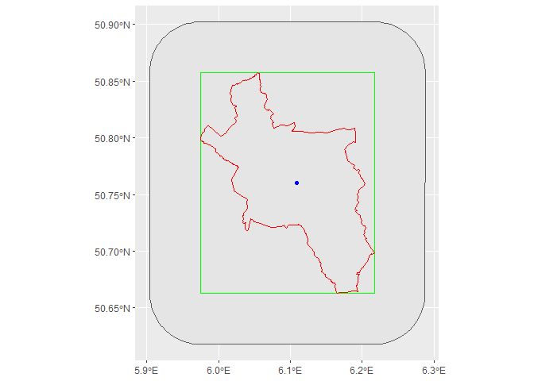

<!-- README.md is generated from README.Rmd. Please edit that file -->

# vg250

<!-- badges: start -->

[](https://github.com/dimfalk/vg250/actions/workflows/R-CMD-check.yaml)
[](https://app.codecov.io/gh/dimfalk/vg250)
<!-- badges: end -->

vg250 aims to provide access to VG250 dataset in order to derive spatial
information for a chosen administrative level for various applications.

Since I found myself in the need of spatial information on a
municipality level (geometry, extent, centroids) for convenience reasons
quite often, the decision was made to centralize associated data and
functions based on `{sf}` in a separate package to simplify access and
maintenance.

## Installation

You can install the development version of vg250 with:

``` r
# install.packages("devtools")
devtools::install_github("dimfalk/vg250")
```

and load the package via

``` r
library(vg250)
#> 0.5.18
```

## Getting started

Just to provide a few quick insights on the use of this package:

``` r
# fetch data
name <- "Aachen"

ext <- get_extent(name)
buff <- get_extent(name, buffer = 5000)
geom <- get_geometry(name)
p <- get_centroid(name)

# check classes
class(ext)
#> [1] "sfc_POLYGON" "sfc"
class(buff)
#> [1] "sfc_POLYGON" "sfc"
class(geom)
#> [1] "sfc_POLYGON" "sfc"
class(p)
#> [1] "sfc_POINT" "sfc"

# inspect visually
library(ggplot2)

ggplot() + 
  geom_sf(data = buff) + 
  geom_sf(data = ext, col = "green") + 
  geom_sf(data = geom, col = "red") + 
  geom_sf(data = p, col = "blue")
```



This information can now be used to e.g. create masks to crop raster
data, select vector features, perform spatial joins, construct API
calls, etc.

``` r
# convert to SpatExtent object when working with `{terra}`
terra::vect(ext) |> terra::ext()
#> SpatExtent : 5.9748614, 6.2169125, 50.6627898, 50.8573535 (xmin, xmax, ymin, ymax)

# select vector features by p
sf::st_filter(vg250, p)
#> Simple feature collection with 1 feature and 5 fields
#> Geometry type: MULTIPOLYGON
#> Dimension:     XY
#> Bounding box:  xmin: 5.974861 ymin: 50.66279 xmax: 6.216912 ymax: 50.85735
#> Geodetic CRS:  WGS 84
#> # A tibble: 1 × 6
#>   GEM    KRS                 LAN             EWZ   KFL                      geom
#> * <chr>  <chr>               <chr>         <dbl> <dbl>        <MULTIPOLYGON [°]>
#> 1 Aachen Städteregion Aachen Nordrhein-W… 252769  161. (((6.057066 50.85417, 6.…

# join attributes spatially to p
sf::st_intersection(vg250, p)
#> Simple feature collection with 1 feature and 5 fields
#> Geometry type: POINT
#> Dimension:     XY
#> Bounding box:  xmin: 6.109002 ymin: 50.76053 xmax: 6.109002 ymax: 50.76053
#> Geodetic CRS:  WGS 84
#> # A tibble: 1 × 6
#>   GEM    KRS                 LAN             EWZ   KFL                geom
#> * <chr>  <chr>               <chr>         <dbl> <dbl>         <POINT [°]>
#> 1 Aachen Städteregion Aachen Nordrhein-W… 252769  161. (6.109002 50.76053)

# construct API queries
sf::st_bbox(ext) |> as.numeric() |> round(4) |> paste0(collapse = ",") |> paste0("&bbox=", x = _)
#> [1] "&bbox=5.9749,50.6628,6.2169,50.8574"
```

Note: The VG250 dataset itself can be accessed via `vg250`:

``` r
vg250
#> Simple feature collection with 10978 features and 5 fields
#> Geometry type: GEOMETRY
#> Dimension:     XY
#> Bounding box:  xmin: 5.86625 ymin: 47.27012 xmax: 15.04182 ymax: 55.05878
#> Geodetic CRS:  WGS 84
#> # A tibble: 10,978 × 6
#>    GEM                 KRS         LAN      EWZ    KFL                      geom
#>  * <chr>               <chr>       <chr>  <dbl>  <dbl>        <MULTIPOLYGON [°]>
#>  1 Flensburg           Flensburg   Schl…  92667  56.7  (((9.412137 54.82382, 9.…
#>  2 Kiel                Kiel        Schl… 248873 119.   (((10.16852 54.43284, 10…
#>  3 Lübeck              Lübeck      Schl… 219044 214.   (((10.87526 53.98833, 10…
#>  4 Neumünster          Neumünster  Schl…  80185  71.7  (((9.991971 54.14988, 9.…
#>  5 Brunsbüttel         Dithmarsch… Schl…  12651  65.2  (((9.166074 53.94532, 9.…
#>  6 Heide               Dithmarsch… Schl…  22467  32.0  (((9.121658 54.20769, 9.…
#>  7 Averlak             Dithmarsch… Schl…    587   9.06 (((9.212443 53.95312, 9.…
#>  8 Brickeln            Dithmarsch… Schl…    191   6.07 (((9.255627 54.02135, 9.…
#>  9 Buchholz            Dithmarsch… Schl…    995  14.6  (((9.182763 53.99953, 9.…
#> 10 Burg (Dithmarschen) Dithmarsch… Schl…   4173  11.2  (((9.277097 54.01499, 9.…
#> # ℹ 10,968 more rows
```
